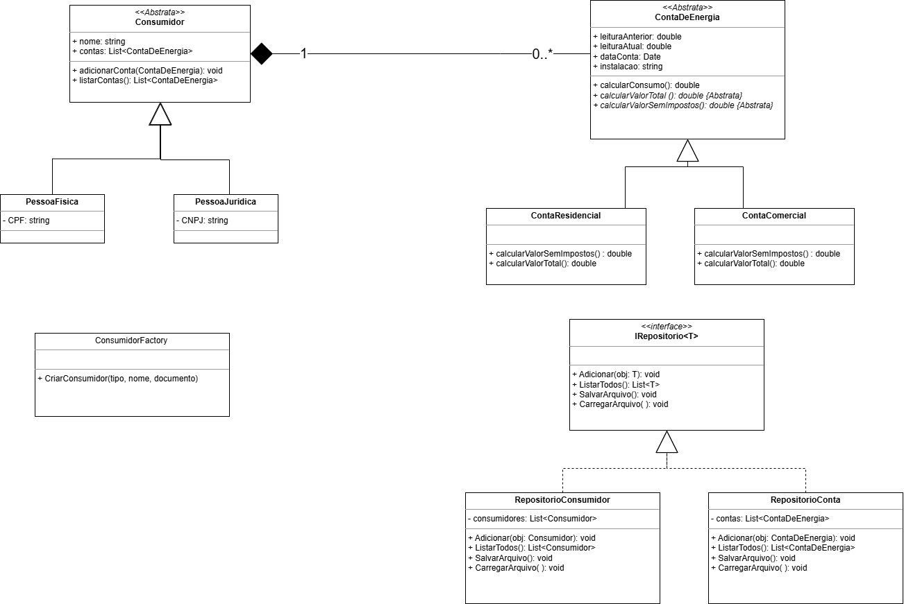

# Trabalho Final – Consumo de Energia

## 📋 Escopo do Projeto

Este projeto foi desenvolvido como trabalho final da disciplina, com o objetivo de criar um aplicativo para auxiliar clientes a controlar seus gastos com contas de energia elétrica.

## 🏗️ Estrutura do Projeto

```
pco-ads-2025-1-p3-poo-tp-grupo-03/
├── docs/
│   └── DiagramaCalculoEnergia.png
├── src/
│   └── ControleDeEnergia/
│       ├── ControleDeEnergia/
│       │   ├── Properties/
│       │   │   └── Resources.resx
│       │   ├── Factories/
│       │   │   └── ConsumidorFactory.cs
│       │   ├── Forms/
│       │   │   ├── CadastroConsumidorUserControl.cs
│       │   │   ├── CadastroContaUserControl.cs
│       │   │   ├── ConsultUserControl.cs
│       │   │   ├── Form1.cs
│       │   │   └── InicioUserControl.cs
│       │   ├── Models/
│       │   │   ├── Consumidor.cs
│       │   │   ├── ContaComercial.cs
│       │   │   ├── ContaDeEnergia.cs
│       │   │   ├── ContaResidencial.cs
│       │   │   ├── PessoaFisica.cs
│       │   │   └── PessoaJuridica.cs
│       │   ├── Repositories/
│       │   │   ├── IRepositorio.cs
│       │   │   ├── RepositorioConsumidor.cs
│       │   │   └── RepositorioConta.cs
│       │   └── Utils/
│       └── ControleDeEnergia.sln
└── README.md
```

## 📊 Diagrama de Classes



## 📋 Funcionalidades

### Tipos de Conta

- **Conta Residencial**: Tarifa de R$ 0,40 por kW/h + imposto de 30%
- **Conta Comercial**: Tarifa de R$ 0,35 por kW/h + imposto de 18%

### Características do Sistema

- Cada conta está associada a um CPF (pessoa física) ou CNPJ (pessoa jurídica)
- Pessoas físicas e jurídicas podem ter múltiplas contas
- Armazena leitura do mês atual e anterior
- Consumo calculado pela diferença entre leituras (kW/h)
- Contribuição para iluminação pública: R$ 9,25

### Cálculo do Valor da Conta

```
Valor Total = (Consumo × Tarifa + Contribuição) × (1 + Imposto)
```

## 🔧 Funcionalidades Implementadas

1. **Cadastro e consulta** de consumidores e contas
2. **Persistência de dados** em arquivo (XML/JSON)
3. **Consultas disponíveis** dado um identificador de cliente:
   - Consumo de energia no último mês
   - Valor total da conta
   - Valor da conta sem impostos

## 💻 Tecnologias Utilizadas

- **Linguagem**: C#
- **Interface**: Windows Forms
- **Persistência**: Arquivo XML/JSON
- **Paradigma**: Programação Orientada a Objetos

## 📋 Requisitos Técnicos

- ✅ Modelagem baseada em classes e objetos
- ✅ Interface gráfica
- ✅ Leitura e escrita em arquivo
- ✅ Princípios de POO aplicados

## 👥 Participantes do Grupo

- **Pablo Marques**
- **Thiago Marques**
- **Luis Gustavo**

## 🎥 Demonstração

[Vídeo de demonstração da aplicação](https://drive.google.com/file/d/1GqxjrDNgtQ43DqwCwoBXliy80fIzaS_e/view?usp=sharing)

## 📁 Documentação

- Diagrama de classes disponível em [`docs/DiagramaCalculoEnergia.png`](docs/DiagramaCalculoEnergia.png)

---

\*Projeto desenvolvido para a disciplina de Programação Orientada a Objetos -
